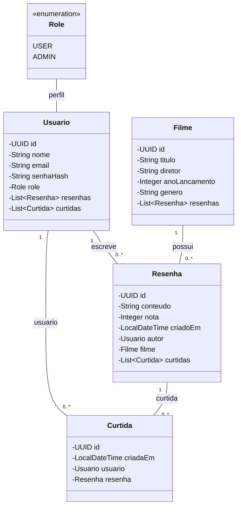

# API de Resenhas de Filmes

Esta é uma API REST em Java com Spring Boot que permite:
- Usuários se cadastrarem e autenticarem.
- Registrar, atualizar, visualizar e deletar resenhas de filmes.
- Curtir resenhas de outros usuários.
- Consultar filmes e resenhas associadas.

## Modelo de Domínio

## Tecnologias

 - Java 21
 - Spring Boot
- H2 DataBase (dev)
- PostgreSQL (produção)
- Maven
