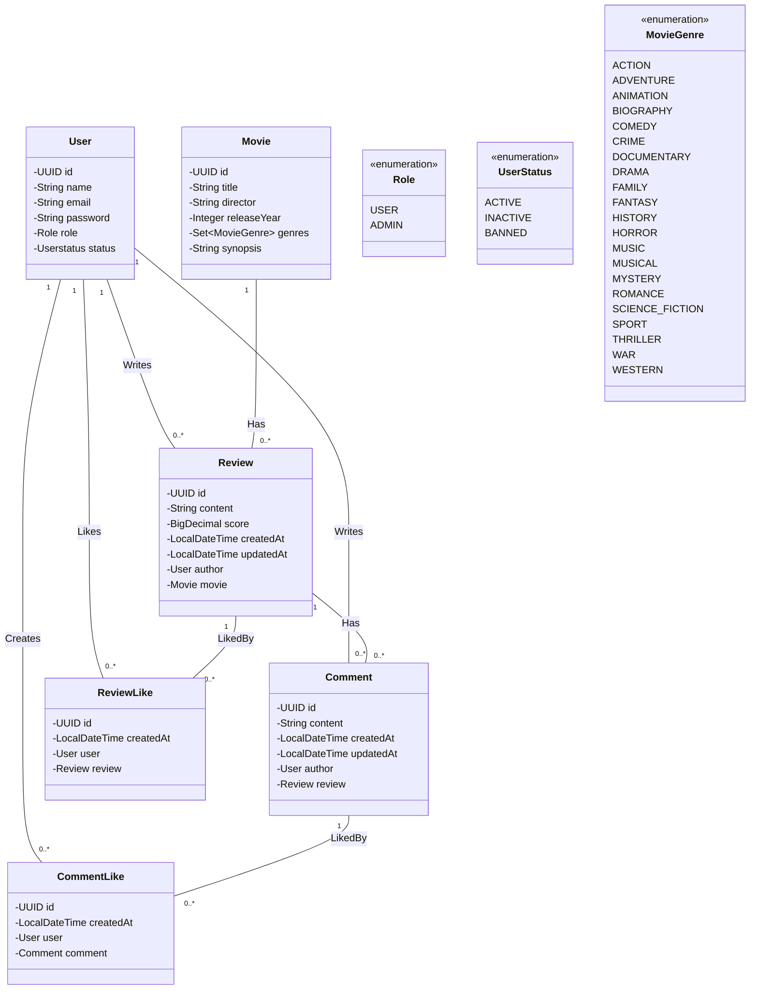

# Movie Reviews API

English | [Português](docs/README-PT/README-PT.md)

A RESTful API built with **Java 21 and Spring Boot** that allows users to review movies, comment on reviews, and interact with other users through likes.
The project was designed to practice backend development concepts such as REST APIs, authentication and authorization, database modeling, and clean architecture using the Spring ecosystem.

---

## Features

- User registration and authentication
- JWT-based authentication and authorization
- Create, update, delete and view movie reviews
- Comment on reviews
- Like reviews and comments
- Browse movies and their associated reviews
- Role-based access control (USER / ADMIN)

---

## Domain Model


```mermaid
classDiagram
    class User {
        -UUID id
        -String name
        -String email
        -String password
        -Role role
        -Userstatus status
    }

    class Movie {
        -UUID id
        -String title
        -String director
        -Integer releaseYear
        -Set~MovieGenre~ genres
        -String synopsis
    }

    class Review {
        -UUID id
        -String content
        -BigDecimal score
        -LocalDateTime createdAt
        -LocalDateTime updatedAt
        -User author
        -Movie movie
    }
    
    class Comment{
        -UUID id
        -String content
        -LocalDateTime createdAt
        -LocalDateTime updatedAt
        -User author
        -Review review
    }   

    class ReviewLike {
        -UUID id
        -LocalDateTime createdAt
        -User user
        -Review review
    }
    
    class CommentLike {
        -UUID id
        -LocalDateTime createdAt
        -User user
        -Comment comment
    }

    class Role {
        <<enumeration>>
        USER
        ADMIN
    }
    
    class UserStatus {
        <<enumeration>>
        ACTIVE
        INACTIVE
        BANNED
    }
    
    class MovieGenre {
        <<enumeration>>
        ACTION
        ADVENTURE
        ANIMATION
        BIOGRAPHY
        COMEDY
        CRIME
        DOCUMENTARY
        DRAMA
        FAMILY
        FANTASY
        HISTORY
        HORROR
        MUSIC
        MUSICAL
        MYSTERY
        ROMANCE
        SCIENCE_FICTION
        SPORT
        THRILLER
        WAR
        WESTERN
    }

    User "1" -- "0..*" Review : Writes
    User "1" -- "0..*" ReviewLike : Likes
    User "1" -- "0..*" Comment: Writes
    User "1" -- "0..*" CommentLike: Creates
    
    Movie "1" -- "0..*" Review : Has
    Review "1" -- "0..*" Comment: Has
    Review "1" -- "0..*" ReviewLike : LikedBy
    Comment "1" -- "0..*" CommentLike: LikedBy
    
    %% ReviewLike unique(user, review)
    %% CommentLike unique(user, comment)
    %% Review unique(author, movie)
 
```
---

## Tech Stack

### Backend
- **Java 21**
- **Spring Boot**

### Persistence
- **Spring Data JPA**
- **PostgreSQL** (production)
- **H2 Database** (development)

### Security
- **Spring Security**
- **JWT Authentication**

### Build Tool
- **Maven**

### API Documentation
- **Swagger / OpenAPI**

---
## Architecture

The application follows a **Package by Feature** architecture, where code is organized
around business features rather than technical layers. Each feature package is
self-contained, grouping its own Controller, Service, Repository, Domain entity, and DTOs.
```
com.moviereviews
├── auth/
├── user/
├── movie/
├── review/
├── comment/
├── like/
└── shared/
    ├── audit/
    ├── security/
    └── exception/
```

### Feature Package Structure

Each feature follows the same internal layering:
```
Controller → Service → Repository → Database
```

| Class | Role |
|---|---|
| `Controller` | Exposes REST endpoints, delegates to Service |
| `Service` | Contains business logic, orchestrates domain operations |
| `Repository` | Handles data persistence via Spring Data JPA |
| `Domain` | Entity and core domain model for the feature |
| `dto/` | Request and response objects — never expose entities directly |

### Shared Package

Cross-cutting concerns that are not tied to any single feature live in `shared/`:

| Sub-package | Responsibility |
|---|---|
| `shared.audit` | `BaseEntity` with `id`, `createdAt`, `updatedAt` inherited by all entities |
| `shared.security` | JWT filter, `UserPrincipal`, `CustomUserDetailsService` |
| `shared.exception` | `GlobalExceptionHandler` and domain exception hierarchy |

### Why Package by Feature

Organizing by feature rather than by layer means that everything related to a
business concept lives in one place. Adding or modifying a feature requires changes
in a single package, reducing the risk of unintended side effects in other parts of
the codebase. It also provides a natural boundary for future extraction into
independent modules or services.

---
## Getting Started

### Prerequisites

- Java 21
- Maven
- PostgreSQL (optional for production environment)

### Run the Project

Clone the repository:

``` bash
    git clone https://github.com/yourusername/movie-reviews-api
    cd movie-reviews-api
```

Run the application:

```bash
  mvn spring-boot:run
```

The API will start at:
http://localhost:8080

## API Documentation

Swagger UI will be available at:

http://localhost:8080/swagger-ui.html
