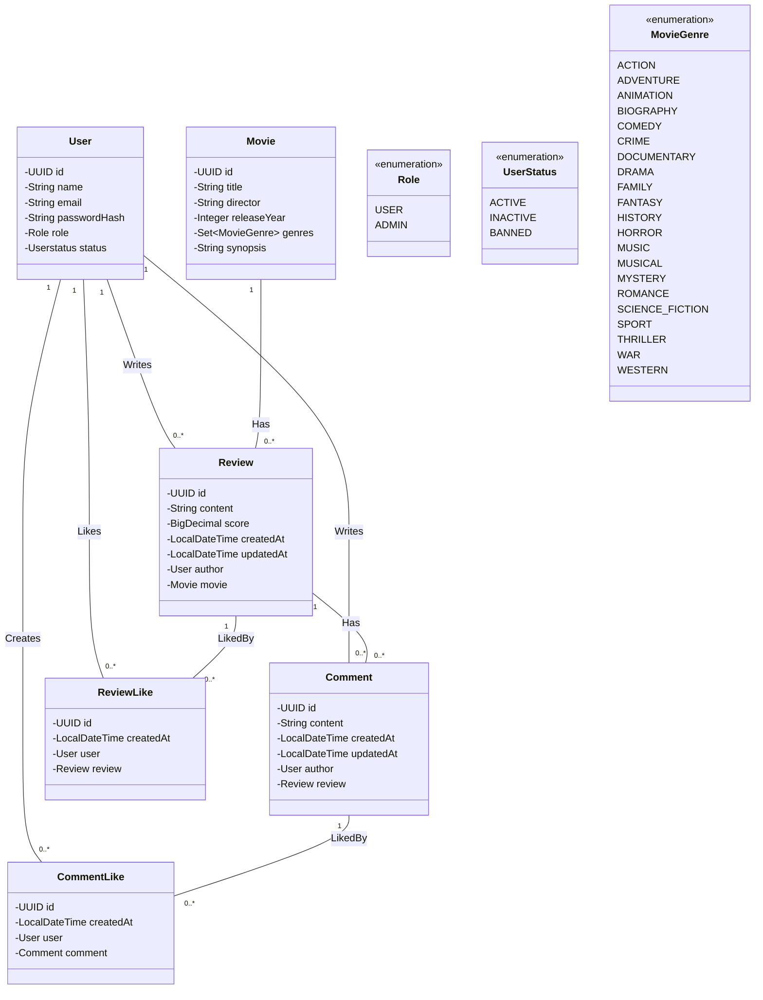

# API de Avaliações de Filmes

Português | [English](../../README.md)

Uma API RESTful construída com **Java 21 e Spring Boot** que permite aos
usuários avaliar filmes, comentar em avaliações e interagir com outros
usuários por meio de curtidas.

O projeto foi desenvolvido para praticar conceitos de desenvolvimento
backend como APIs REST, autenticação e autorização, modelagem de banco
de dados e arquitetura limpa utilizando o ecossistema Spring.

------------------------------------------------------------------------

## Funcionalidades

-   Registro e autenticação de usuários
-   Autenticação e autorização baseadas em JWT
-   Criar, atualizar, excluir e visualizar avaliações de filmes
-   Comentar em avaliações
-   Curtir avaliações e comentários
-   Navegar pelos filmes e suas avaliações associadas
-   Controle de acesso baseado em papéis (USER / ADMIN)

------------------------------------------------------------------------

## Modelo de Domínio



------------------------------------------------------------------------

## Tecnologias Utilizadas

### Backend

-   **Java 21**
-   **Spring Boot**

### Persistência

-   **Spring Data JPA**
-   **PostgreSQL** (produção)
-   **H2 Database** (desenvolvimento)

### Segurança

-   **Spring Security**
-   **Autenticação JWT**

### Ferramenta de Build

-   **Maven**

### Documentação da API

-   **Swagger / OpenAPI**

------------------------------------------------------------------------

## Arquitetura

A aplicação segue a arquitetura **Package by Feature**, onde o código é organizado
em torno das funcionalidades de negócio e não de camadas técnicas. Cada pacote de
feature é autocontido, agrupando seu próprio Controller, Service, Repository,
entidade de domínio e DTOs.
```
com.moviereviews
├── auth/
├── user/
├── movie/
├── review/
├── comment/
├── like/
└── shared/
    ├── audit/
    ├── security/
    └── exception/
```

### Estrutura interna de cada feature

Cada feature segue o mesmo fluxo interno de camadas:
```
Controller → Service → Repository → Database
```

| Classe | Responsabilidade |
|---|---|
| `Controller` | Expõe os endpoints REST e delega ao Service |
| `Service` | Contém a lógica de negócio e orquestra as operações do domínio |
| `Repository` | Gerencia a persistência de dados via Spring Data JPA |
| `Domain` | Entidade e modelo de domínio da feature |
| `dto/` | Objetos de entrada e saída — entidades nunca são expostas diretamente |

### Pacote shared

Responsabilidades transversais que não pertencem a nenhuma feature específica
ficam em `shared/`:

| Sub-pacote | Responsabilidade |
|---|---|
| `shared.audit` | `BaseEntity` com `id`, `createdAt` e `updatedAt` herdados por todas as entidades |
| `shared.security` | Filtro JWT, `UserPrincipal` e `CustomUserDetailsService` |
| `shared.exception` | `GlobalExceptionHandler` e hierarquia de exceções de domínio |

### Por que Package by Feature

Organizar por feature em vez de por camada significa que tudo relacionado a um
conceito de negócio vive em um único lugar. Adicionar ou modificar uma feature
requer mudanças em um único pacote, reduzindo o risco de efeitos colaterais em
outras partes do código. Essa abordagem também cria fronteiras naturais para uma
futura extração em módulos ou serviços independentes.

------------------------------------------------------------------------

## Como Executar o Projeto

### Pré-requisitos

-   Java 21
-   Maven
-   PostgreSQL (opcional para ambiente de produção)

### Executando o Projeto

Clone o repositório:

```bash
      git clone https://github.com/yourusername/movie-reviews-api
      cd movie-reviews-api
```

Execute a aplicação:

```bash
    mvn spring-boot:run
```

A API será iniciada em:

http://localhost:8080

------------------------------------------------------------------------

## Documentação da API

A interface do Swagger estará disponível em:

http://localhost:8080/swagger-ui.html
